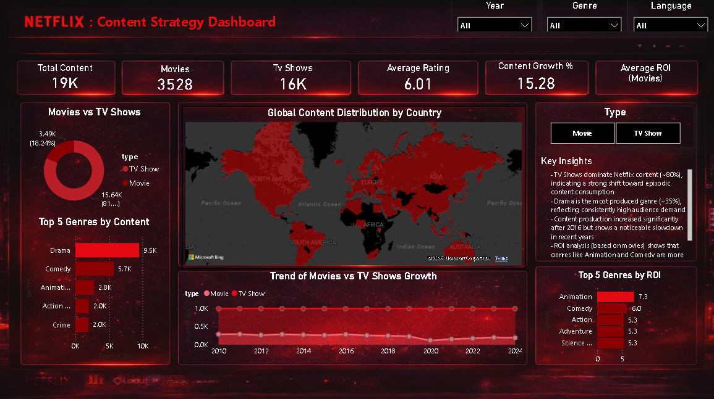

<div align="center">


<br/><br/>

```
                    ███╗   ██╗███████╗████████╗███████╗██╗     ██╗██╗  ██╗
                    ████╗  ██║██╔════╝╚══██╔══╝██╔════╝██║     ██║╚██╗██╔╝
                    ██╔██╗ ██║█████╗     ██║   █████╗  ██║     ██║ ╚███╔╝ 
                    ██║╚██╗██║██╔══╝     ██║   ██╔══╝  ██║     ██║ ██╔██╗ 
                    ██║ ╚████║███████╗   ██║   ██║     ███████╗██║██╔╝ ██╗
                    ╚═╝  ╚═══╝╚══════╝   ╚═╝   ╚═╝     ╚══════╝╚═╝╚═╝  ╚═╝
```

# 🎬 Content Strategy Intelligence Dashboard

### *Turning 15,000+ Netflix titles into actionable business insights*

<br/>

[](https://github.com/Inder616/Netflix-content-strategy-dashboard)
[](https://github.com/Inder616/Netflix-content-strategy-dashboard)
[](https://www.linkedin.com/in/inder-a61a57307/)

</div>

---

## 🔴 What Is This?

> **A fully interactive Power BI dashboard** that dissects Netflix's entire content library — revealing hidden patterns in genre performance, regional production, financial ROI, and growth trajectories that drive smarter content investment decisions.

No fluff. Pure signal.

---

## 📊 Dashboard at a Glance

<div align="center">

| Metric | What It Answers |
|--------|----------------|
| 🎯 **KPI Cards** | How much content exists? How's it split? |
| ⭐ **Rating Analysis** | What content actually satisfies audiences? |
| 💰 **ROI Tracker** | Which movies are financially worth it? |
| 🌍 **World Map View** | Where is content being made? |
| 📈 **Growth Timeline** | When did Netflix go into overdrive? |
| 🎭 **Genre Leaderboard** | What genres dominate volume vs. quality? |

</div>

---

## 🚀 Key Business Insights

<table>
<tr>
<td width="50%">

### 📺 Content Dominance
- **TV Shows make up ~80%** of the library — a clear strategic pivot toward episodic, binge-worthy content
- **Drama reigns supreme** across both volume and audience demand

</td>
<td width="50%">

### 💎 Quality Gems
- **History, War & Music** genres consistently score highest in ratings
- These niche categories are **underproduced but over-appreciated**

</td>
</tr>
<tr>
<td width="50%">

### 📈 The 2016 Effect
- Content growth increased significantly after 2016, showing a clear expansion phase in content addition
</td>
<td width="50%">

### 💵 Movie ROI
- Movies show strong ROI based on available budget and profit data, with certain genres performing better than others

</td>
</tr>
</table>

---

## 🧠 Strategic Recommendations

```
┌─────────────────────────────────────────────────────────────┐
│  1. 🎭  Double down on Drama + niche high-rated genres       │
│  2. 📺  Prioritize TV Shows to maximize retention metrics    │
│  3. 🌏  Expand regional production — Asia & LATAM untapped  │
│  4. 💰  Replicate high-ROI movie budget patterns             │
└─────────────────────────────────────────────────────────────┘
```

---

## 🛠️ Tech Stack

```
Data Pipeline
─────────────
Kaggle Dataset  ──►  Python (Clean & Append)  ──►  Power BI
                                                      │
                                          ┌───────────┴───────────┐
                                     Power Query              DAX Measures
                                  (Genre Splitting)       (SUMX, VALUES, ROI)
```

| Layer | Tool | Purpose |
|-------|------|---------|
| 🐍 **Python** | Pandas | Data cleaning, Append Movies + TV Shows datasets |
| 🔄 **Power Query** | Data Transformation| Genre column splitting (multi-value → multiple rows) |
| 📐 **DAX** | SUMX / VALUES | Duplicate-safe measures for accurate KPIs |
| 📊 **Power BI** | Desktop | Dashboard, visualizations, interactivity |

---

## 📁 Dataset Details

> **Source:** [Netflix Movies and TV Shows till 2025 – Kaggle](https://www.kaggle.com/datasets/bhargavchirumamilla/netflix-movies-and-tv-shows-till-2025) — Dataset includes detailed information on Netflix content (movies and TV shows). The two datasets were cleaned and appended into a single dataset for analysis.

**⚠️ Important Note on Genre Data:**
The genre column was split from multi-value cells into individual rows. This means **one title may appear multiple times** — once per genre. This is **intentional and by design**, not a data quality issue. All DAX measures account for this using `SUMX` + `VALUES` to prevent double-counting.

**⚠️ Financial Data Scope:**
Budget, Revenue & Profit data exists **only for Movies**. TV Shows have null values for financial fields. ROI is therefore **exclusively calculated for Movies** to maintain statistical accuracy.

---

## 📸 Dashboard Preview



---

### 🔗 Repository Link
[Open Repository](https://github.com/Inder616/Netflix-content-strategy-dashboard)

---
## ▶️ How to Run

```bash
# Step 1 — Clone this repo
git clone https://github.com/Inder616/Netflix-content-strategy-dashboard.git

# Step 2 — Open the dashboard
# Launch Power BI Desktop → Open File → select the .pbix file

# Step 3 — Explore
# Use the Content Type filter (Movie / TV Show) to slice every visual
```

## 👤 About the Author

<div align="center">

**Aspiring Data Analyst** passionate about transforming raw data into decisions that matter.

`Power BI` · `Python` · `SQL` · `DAX` · `Data Storytelling`

[](https://www.linkedin.com/in/inder-a61a57307/)

</div>

---

<div align="center">

*Built with 🎬 for the data-curious and the strategy-obsessed*

⭐ **If this project helped you, drop a star!** ⭐

</div>
